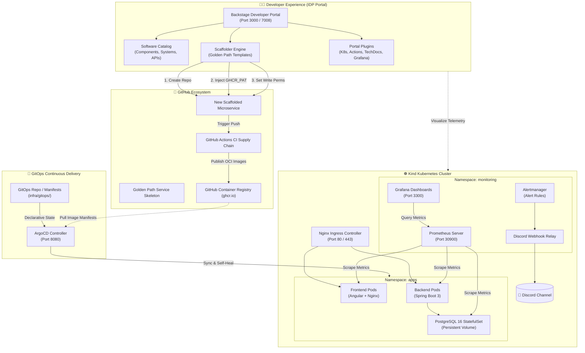
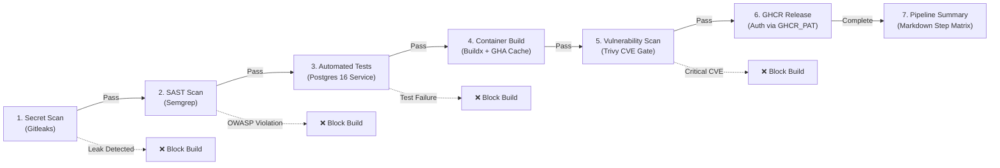
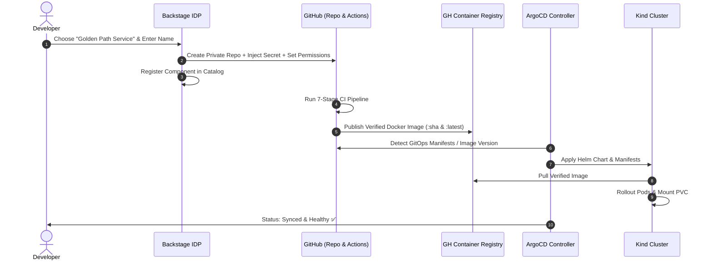

# 🚀 Enterprise Internal Developer Platform (IDP)

> **A Production-Grade Developer Platform built on Backstage, Kubernetes, ArgoCD GitOps, GitHub Actions Supply Chain Security, and Full-Stack Observability.**

[](https://backstage.io)
[](https://kubernetes.io)
[](https://argo-cd.readthedocs.io)
[](https://github.com/features/actions)
[](https://trivy.dev)
[](https://prometheus.io)

---

## 📑 Table of Contents

- [Executive Summary](#-executive-summary)
- [Architecture & Workflow Diagrams](#-architecture--workflow-diagrams)
  - [1. High-Level IDP Architecture](#1-high-level-idp-architecture)
  - [2. Golden Path Supply Chain Security Pipeline](#2-golden-path-supply-chain-security-pipeline)
  - [3. GitOps Continuous Delivery Loop](#3-gitops-continuous-delivery-loop)
- [Requirements Traceability Matrix](#-requirements-traceability-matrix)
- [Repository Structure](#-repository-structure)
- [Quickstart Guide](#-quickstart-guide)
  - [Prerequisites](#prerequisites)
  - [Phase 1: Cluster & Infrastructure Provisioning](#phase-1-cluster--infrastructure-provisioning)
  - [Phase 2: ArgoCD GitOps Deployment](#phase-2-argocd-gitops-deployment)
  - [Phase 3: Launching the Backstage Portal](#phase-3-launching-the-backstage-portal)
- [Developer Golden Path & Scaffolding](#-developer-golden-path--scaffolding)
- [Supply Chain Security & CI/CD Standards](#-supply-chain-security--cicd-standards)
- [Observability & Incident Management](#-observability--incident-management)
- [Troubleshooting & Gotchas](#-troubleshooting--gotchas)

---

## 🌟 Executive Summary

This project delivers a **100% code-driven Internal Developer Platform (IDP)** designed to eliminate developer cognitive load, standardize infrastructure provisioning, and enforce automated security and operational excellence.

### Key Architectural Tenets:
1. **Zero Frontend/Backend Boilerplate in Backstage**: Configured strictly through plugins, declarative `app-config.yaml`, and modular backend extensions.
2. **Self-Service Golden Paths**: Developers scaffold standardized, production-ready microservices (Spring Boot 3 + Angular + PostgreSQL + Helm Chart) in 1-click.
3. **Automated Platform Policy Enforcement**: GitHub repository creation, workflow write permissions, and GHCR publishing secrets (`GHCR_PAT`) are injected automatically with **0 manual repository settings required**.
4. **Shift-Left Supply Chain Security**: 7-stage decoupled CI pipelines executing secret detection (Gitleaks), SAST code analysis (Semgrep), unit/integration tests with real databases, container packaging (Buildx cache), container vulnerability scanning (Trivy), and GHCR publishing.
5. **GitOps Continuous Delivery (ArgoCD)**: Automated drift detection, self-healing, and declarative Kubernetes synchronization from Git.
6. **Full-Stack Observability**: Prometheus metrics scraping (`ServiceMonitor`), custom Grafana dashboards, Alertmanager threshold alerting, and Discord incident webhook relays.

---

## 🏛️ Architecture & Workflow Diagrams

### 1. High-Level IDP Architecture



---

### 2. Golden Path Supply Chain Security Pipeline

Every scaffolded service and existing app follows a standardized 7-stage quality and security gate:



---

### 3. GitOps Continuous Delivery Loop



---

## 📋 Requirements Traceability Matrix

### Functional Requirements (BF)

| ID | Requirement | Implementation Component | Status |
|---|---|---|:---:|
| **BF-01** | Backend Microservice | Spring Boot 3, Java 17 Temurin, Hibernate, Actuator Prometheus metrics | ✅ **PASS** |
| **BF-02** | Frontend Web App | Angular 17+, Nginx 1.27 Alpine, responsive UI, Dockerized build | ✅ **PASS** |
| **BF-03** | Relational Database | PostgreSQL 16 Alpine, PersistentVolumeClaim, Kubernetes Secret auth | ✅ **PASS** |
| **BF-04** | Helm Packaging | Parameterized Helm Chart with Ingress, ServiceMonitors, Grafana Dashboards | ✅ **PASS** |
| **BF-05** | Central IDP Portal | Backstage.io v1.36 pure configuration, Software Catalog, User/Group entities | ✅ **PASS** |
| **BF-06** | Kubernetes Integration | `@backstage/plugin-kubernetes` connected to `kind-idp-backstage` cluster | ✅ **PASS** |
| **BF-07** | CI/CD Visibility | `@backstage/plugin-github-actions` rendering live workflow runs in portal | ✅ **PASS** |
| **BF-08** | Technical Docs | `@backstage/plugin-techdocs` rendering Markdown docs in entity pages | ✅ **PASS** |
| **BF-09** | Observability Dashboards | Grafana proxy `/grafana` + direct dashboard ConfigMap provisioning | ✅ **PASS** |
| **BF-10** | Incident Simulation | PagerDuty proxy endpoints + Discord Alertmanager webhook relay | ✅ **PASS** |
| **BF-11** | Golden Path Scaffolding | `templates/golden-path-service` with automated secrets & write permissions | ✅ **PASS** |

### Non-Functional Requirements (BNF)

| ID | Requirement | Implementation Standard | Status |
|---|---|---|:---:|
| **BNF-01** | Security Shift-Left | Gitleaks (no secrets), Semgrep (OWASP Top 10), Trivy (blocking CVEs) | ✅ **PASS** |
| **BNF-02** | Container Security | Non-root users (`appuser:appgroup`), minimal Alpine base images | ✅ **PASS** |
| **BNF-03** | Supply Chain Integrity | OCI compliant container images published to `ghcr.io` with immutable SHA tags | ✅ **PASS** |
| **BNF-04** | GitOps Automation | ArgoCD automated synchronization, self-healing, pruning enabled | ✅ **PASS** |
| **BNF-05** | High Availability | Pod anti-affinity, readiness/liveness probes, persistent volume storage | ✅ **PASS** |
| **BNF-06** | Telemetry Export | Prometheus metrics on `/actuator/prometheus` & Nginx status metrics | ✅ **PASS** |
| **BNF-07** | Developer Autonomy | 100% self-service scaffolding without manual ticket creation or repo clicks | ✅ **PASS** |
| **BNF-08** | Code Quality | Automated unit & integration tests run against PostgreSQL test containers in CI | ✅ **PASS** |
| **BNF-09** | Clean Architecture | Zero hardcoded tokens; declarative configuration via `.env` and ConfigMaps | ✅ **PASS** |

---

## 📂 Repository Structure

```text
idp-backstage/
├── .github/
│   └── workflows/              # Root CI/CD workflows (CRM Backend & Frontend)
├── apps/
│   └── crm/                    # Reference Multi-Tier Application
│       ├── catalog-info.yaml   # Backstage Software Catalog Entity Definition
│       ├── crm-backend/        # Spring Boot 3 + Java 17 + PostgreSQL REST API
│       ├── crm-frontend/       # Angular 17 + Nginx Single Page App
│       └── crm-chart/          # Production Helm Chart (Deployments, Ingress, Observability)
├── backstage/                  # Central Internal Developer Platform (Backstage.io)
│   ├── app-config.yaml         # Declarative Backstage Configuration (Plugins, Proxies, Catalogs)
│   ├── catalog-info.yaml       # Backstage System Catalog Descriptor
│   ├── packages/
│   │   ├── app/                # Backstage Frontend Shell
│   │   └── backend/            # Backstage Backend + Custom Scaffolder Modules
│   └── .env.example            # Environment Variable Template
├── infra/
│   ├── argocd/                 # ArgoCD GitOps Engine Deployment & Patch Scripts
│   ├── gitops/                 # ArgoCD Application Manifests (crm-application.yaml)
│   └── kind/                   # Kind Kubernetes Cluster Configuration (Port Mappings)
├── templates/
│   └── golden-path-service/    # Developer Golden Path Software Template
│       ├── template.yaml       # Scaffolder Definition (Fetch -> Publish -> Secret -> Perms -> Register)
│       └── skeleton/           # Microservice Boilerplate (Spring Boot + Angular + Helm + Workflows)
└── README.md                   # Platform Architecture & Guide (This File)
```

---

## ⚡ Quickstart Guide

### Prerequisites
- **OS**: Linux / WSL2 (Ubuntu 22.04 / 24.04 recommended) or macOS
- **Tools**: Docker Desktop / Docker Engine, `kind`, `kubectl`, `helm` (v3+), `node` (v20+), `yarn` (v1.22+), `gh` (GitHub CLI)

---

### Phase 1: Cluster & Infrastructure Provisioning

1. **Clone the repository**:
   ```bash
   git clone https://github.com/FatmaMejri1/idp-backstage.git
   cd idp-backstage
   ```

2. **Create the Kind Kubernetes Cluster**:
   ```bash
   # Provisions cluster with ports 80, 443, 3300 (Grafana), 30900 (Prometheus)
   kind create cluster --config infra/kind/kind-config.yaml --name idp-backstage
   ```

3. **Deploy Nginx Ingress Controller**:
   ```bash
   kubectl apply -f https://raw.githubusercontent.com/kubernetes/ingress-nginx/main/deploy/static/provider/kind/deploy.yaml
   kubectl wait --namespace ingress-nginx \
     --for=condition=ready pod \
     --selector=app.kubernetes.io/component=controller \
     --timeout=180s
   ```

4. **Deploy Prometheus & Grafana Monitoring Stack**:
   ```bash
   helm repo add prometheus-community https://prometheus-community.github.io/helm-charts
   helm repo update
   helm install prometheus prometheus-community/kube-prometheus-stack \
     --namespace monitoring --create-namespace \
     -f apps/crm/crm-chart/templates/alertmanager-config.yaml
   ```

---

### Phase 2: ArgoCD GitOps Deployment

1. **Install and Configure ArgoCD**:
   ```bash
   chmod +x infra/argocd/install.sh
   ./infra/argocd/install.sh
   ```

2. **Deploy the CRM Application via GitOps**:
   ```bash
   kubectl apply -f infra/gitops/crm-application.yaml
   ```

3. **Verify GitOps Sync Status**:
   ```bash
   kubectl get applications -n argocd crm-app
   # Status will report: Synced & Healthy ✅
   ```

4. **Access the Running Microservices**:
   - **CRM Frontend**: `http://localhost/`
   - **CRM Backend API**: `http://localhost/api/customers`
   - **Prometheus Metrics**: `http://localhost/actuator/prometheus`
   - **ArgoCD Web UI**: `http://localhost:8080`
   - **Grafana Dashboards**: `http://localhost:3300` (User: `admin` / Password: `prom-operator`)

---

### Phase 3: Launching the Backstage Portal

1. **Configure Environment Variables**:
   ```bash
   cd backstage
   cp .env.example .env
   ```
   Add your GitHub Personal Access Token (`GITHUB_TOKEN` with `repo`, `workflow`, `write:packages`):
   ```ini
   GITHUB_TOKEN="ghp_your_github_token_here"
   ```

2. **Install Dependencies & Start Backstage**:
   ```bash
   yarn install
   yarn dev
   ```

3. **Open Developer Portal**:
   - Navigate to **`http://localhost:3000`** in your browser.
   - Explore the **Software Catalog**, **System Topology**, **Live Kubernetes Pod Status**, and **CI/CD History**.

---

## 🛠️ Developer Golden Path & Scaffolding

The platform provides a **Golden Path Service Template** that allows any engineer to scaffold a new production-ready microservice in under 10 seconds:

### How to Scaffold a New Service:
1. Open Backstage at `http://localhost:3000`.
2. Click **Create...** in the sidebar.
3. Select **Golden Path Service** and click **Choose**.
4. Fill in:
   - **Service Name**: `order-service`
   - **Description**: `Handles customer orders and transactions`
5. Click **Next Step** ➔ **Create**.

### What Happens Automatically (Zero Manual Work):
```text
Step 1: Fetch Golden Path Skeleton (Angular + Spring Boot + Postgres + Helm + Workflows)
Step 2: Publish Private GitHub Repository (https://github.com/FatmaMejri1/order-service)
Step 3: [AUTOMATED] Inject GHCR_PAT Secret via Custom Scaffolder Action (gh CLI)
Step 4: [AUTOMATED] Set Workflow Write Permissions via GitHub REST API
Step 5: Register Component in Backstage Software Catalog
```

---

## 🔒 Supply Chain Security & CI/CD Standards

Every repository scaffolded from the Golden Path executes a decoupled 7-stage supply chain pipeline on every commit:

```text
Stage 1: Secret Scan (Gitleaks)
         └─ Scans full commit history for leaked API keys, tokens, and credentials.
Stage 2: SAST Security Scan (Semgrep)
         └─ Scans source code and Dockerfiles against OWASP Top 10 security rules.
Stage 3: Automated Tests (Spring Boot + Postgres)
         └─ Boots real PostgreSQL 16 test container and executes unit & integration tests.
Stage 4: Container Build (OCI Package)
         └─ Builds optimized container images with Buildx and GitHub Actions layer caching.
Stage 5: Container Vulnerability Scan (Trivy)
         └─ Scans container layers for CRITICAL and HIGH CVE vulnerabilities.
Stage 6: GHCR Release (Publish OCI Images)
         └─ Authenticates with GHCR_PAT and publishes images to ghcr.io/<owner>/<name>:<sha>.
Stage 7: Platform Engineering Summary
         └─ Publishes an audit matrix directly to $GITHUB_STEP_SUMMARY.
```

---

## 📊 Observability & Incident Management

```text
┌────────────────────────────────────────────────────────────────────────┐
│                        OBSERVABILITY ARCHITECTURE                      │
│                                                                        │
│   [ Backend Pod ]  ───>  /actuator/prometheus ───┐                     │
│   [ Frontend Pod ] ───>  /metrics (Nginx)     ───┼──> [ Prometheus ]  │
│   [ PostgreSQL ]   ───>  exporter metrics     ───┘          │          │
│                                                             ├──> [ Grafana Dashboards ]
│                                                             │    (Port 3300)
│                                                             │
│                                                             └──> [ Alertmanager ]
│                                                                          │
│                                                                          ▼
│                                                                [ Discord Incident Relay ]
│                                                                          │
│                                                                          ▼
│                                                                 💬 #platform-alerts
└────────────────────────────────────────────────────────────────────────┘
```

- **Prometheus**: Scrapes application metrics every 15s via custom `ServiceMonitor` definitions.
- **Grafana**: Pre-configured with JVM performance, Spring HTTP latency, PostgreSQL connection pools, and Nginx request dashboards.
- **Alertmanager**: Automatically evaluates alerting rules (`HighCpuLoad`, `BackendDown`, `DatabaseConnectionsExhausted`) and sends formatted notifications to Discord via the webhook relay.

---

## 🔧 Troubleshooting & Gotchas

### 1. GHCR Package Push Permission Denied
- **Issue**: `denied: permission_denied: read_package` when pushing to `ghcr.io`.
- **Cause**: Personal GitHub accounts require the publishing token to have the `write:packages` OAuth scope.
- **Solution**: Handled automatically by the Golden Path Scaffolder action (`github:repo:set-secret`), which injects your `GHCR_PAT` into every new repository at creation time.

### 2. Dockerfile SAST Failure (Non-Root User Entrypoint)
- **Issue**: Semgrep flags `dockerfile.security.missing-user-entrypoint`.
- **Solution**: All Dockerfiles in `apps/crm` and `templates/golden-path-service` create unprivileged users (`addgroup -S appgroup && adduser -S appuser -G appgroup`) and specify `USER appuser` before the entrypoint.

### 3. Kind Cluster Port Bindings
- **Issue**: Cannot access `localhost:80`, `localhost:3300`, or `localhost:8080`.
- **Solution**: Ensure no local services (like Apache or local Nginx) are occupying ports 80/443 on the host, and recreate the cluster using `infra/kind/kind-config.yaml`.

---

## 👤 Maintainer

- **Platform Engineer**: Fatma Mejri ([@FatmaMejri1](https://github.com/FatmaMejri1))
- **Repository**: [https://github.com/FatmaMejri1/idp-backstage](https://github.com/FatmaMejri1/idp-backstage)
