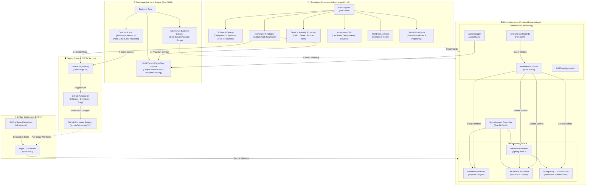
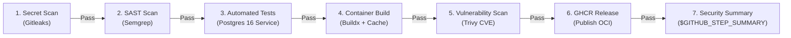
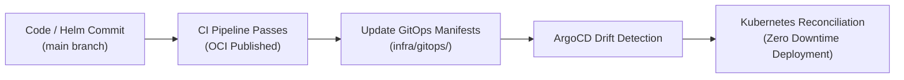

# 🚀 Enterprise Internal Developer Platform (IDP)

> **A Production-Grade Internal Developer Platform built on Spotify Backstage, Kubernetes (Kind), ArgoCD GitOps, GitHub Actions Supply Chain Security, Service Maturity Scorecards, Multi-Tenant PagerDuty On-Call, and Full-Stack Observability.**

[](https://backstage.io)
[](https://kubernetes.io)
[](https://argo-cd.readthedocs.io)
[](https://github.com/features/actions)
[](https://trivy.dev)
[](https://prometheus.io)
[](https://pagerduty.com)
[](#2-service-maturity--quality-scorecards)
[](tests/)

---

## 📑 Table of Contents

- [Executive Summary](#-executive-summary)
- [Architecture & Workflow Diagrams](#-architecture--workflow-diagrams)
  - [1. High-Level IDP Architecture](#1-high-level-idp-architecture)
  - [2. Golden Path Supply Chain Security Pipeline](#2-golden-path-supply-chain-security-pipeline)
  - [3. GitOps Continuous Delivery Loop](#3-gitops-continuous-delivery-loop)
- [Key Features & Capabilities](#-key-features--capabilities)
  - [1. Self-Service Golden Path Templates](#1-self-service-golden-path-templates)
  - [2. Complete Software Catalog & Entity Relations](#2-complete-software-catalog--entity-relations)
  - [3. Service Maturity & Quality Scorecards (100% Gold Tier)](#3-service-maturity--quality-scorecards-100-gold-tier)
  - [4. Dedicated Multi-Tenant PagerDuty On-Call Integration](#4-dedicated-multi-tenant-pagerduty-on-call-integration)
  - [5. Kubernetes Live Workload Visibility](#5-kubernetes-live-workload-visibility)
  - [6. Full-Stack Observability & Prometheus Alerts](#6-full-stack-observability--prometheus-alerts)
  - [7. Shift-Left Supply Chain Security Gate](#7-shift-left-supply-chain-security-gate)
  - [8. TechDocs as Code](#8-techdocs-as-code)
- [Repository Structure](#-repository-structure)
- [Quickstart Guide](#-quickstart-guide)
  - [Prerequisites](#prerequisites)
  - [Phase 1: Cluster & Infrastructure Provisioning](#phase-1-cluster--infrastructure-provisioning)
  - [Phase 2: ArgoCD GitOps Deployment](#phase-2-argocd-gitops-deployment)
  - [Phase 3: Launching the Backstage Portal](#phase-3-launching-the-backstage-portal)
- [Verification & Automated Test Suite](#-verification--automated-test-suite)
- [Troubleshooting & Gotchas](#-troubleshooting--gotchas)
- [Maintainer](#-maintainer)

---

## 🌟 Executive Summary

This project delivers an **enterprise-grade Internal Developer Platform (IDP)** designed to eliminate developer cognitive load, standardize microservice lifecycles, and enforce automated security, observability, and operational excellence across the engineering organization.

### Core Platform Pillars:
1. **Self-Service Golden Paths**: Engineers scaffold production-ready full-stack applications, services, and AI microservices in seconds with automated CI/CD, Helm charts, and catalog registration.
2. **Automated Provisioning & Secrets Injection**: Automatic GitHub repository creation, workflow write permissions, `GHCR_PAT` secret injection, and dedicated PagerDuty on-call service creation via custom Scaffolder actions.
3. **Shift-Left Supply Chain Security**: 7-stage CI/CD security gate combining Gitleaks secrets detection, Semgrep SAST code analysis, PostgreSQL integration testing, container layer vulnerability scanning (Trivy), and GHCR OCI releases.
4. **Declarative GitOps (ArgoCD)**: Continuous delivery with automated drift detection, self-healing, and declarative synchronization from Git to Kubernetes.
5. **Service Maturity Scorecards**: Real-time evaluation of services against 6 platform engineering standards (Security, Documentation, Reliability, Observability, Operations, Delivery) with **Gold Tier (100% Production Ready)** certification.
6. **Multi-Tenant PagerDuty On-Call**: Dedicated PagerDuty escalation policies, on-call schedules, and filtered incident streams per template and microservice.
7. **Unified Kubernetes & Observability**: Native Backstage visibility into live Kubernetes Pods, Deployments, Services, and Ingresses alongside Prometheus alerting rules, Grafana dashboards, and Loki logs.

---

## 🏛️ Architecture & Workflow Diagrams

### 1. High-Level IDP Architecture



---

### 2. Golden Path Supply Chain Security Pipeline

Every scaffolded service and existing application executes an automated 7-stage quality and security gate:



---

### 3. GitOps Continuous Delivery Loop



---

## ⚡ Key Features & Capabilities

### 1. Self-Service Golden Path Templates
The platform includes 3 standardized production templates under [`templates/`](templates/):

| Template | Architecture | Technologies | Features |
| :--- | :--- | :--- | :--- |
| **Golden Path Application** | Full-Stack Web App | Angular, Spring Boot 3, FastAPI + Gemini, PostgreSQL, Helm | Microservice mesh, subcomponents, REST & AI APIs, dedicated database resource, ArgoCD GitOps |
| **Golden Path Service** | Web Platform Service | Angular Frontend, Spring Boot 3 Backend, PostgreSQL 16 | Decoupled CI/CD workflows, Helm charts, ServiceMonitors, PostgreSQL persistence |
| **Golden Path AI Service** | AI Microservice | Python 3.11, FastAPI, Google Gemini LLM, Docker | Swagger UI docs (`/ai/docs`), Prometheus metrics endpoint, Trivy vulnerability scanning |

#### Automated Repository Bootstrapping Steps:
1. Clones and customizes the skeleton repository.
2. Publishes the private repository to GitHub (`FatmaMejri1/<name>`).
3. Injects the `GHCR_PAT` GitHub secret for container registry access using custom backend action `github:repo:set-secret`.
4. Configures repository Actions workflow permissions (`write`).
5. Provisions a dedicated, unique PagerDuty on-call escalation service.
6. Automatically registers the `System`, `Component`, `API`, and `Resource` entities into the Backstage Software Catalog.

---

### 2. Complete Software Catalog & Entity Relations
Every Golden Path component features a complete Backstage software catalog descriptor:
- **Provided APIs**:
  - `*-api`: OpenAPI 3.0 REST specification covering backend endpoints (`/actuator/health`, `/actuator/prometheus`, `/api/v1/items`).
  - `*-ai-api`: OpenAPI 3.0 specification covering Gemini AI endpoints (`/ai/health`, `/ai/analyze`, `/ai/docs`).
- **Consumed APIs**:
  - Frontend and root application components declare explicit consumption of backend and AI endpoints via `spec.consumesApis`.
- **Component Dependencies**:
  - Subcomponent hierarchy established through `spec.dependsOn` and `spec.subcomponentOf`.
- **Resource Dependencies**:
  - Relational database persistence mapped through `spec.dependsOn: [resource:default/*-database]`.
- **Catalog Graph Visualizer**: Complete interactive directed graph rendering of all components, systems, APIs, resources, and owners.

---

### 3. Service Maturity & Quality Scorecards (100% Gold Tier)
Evaluates services in real-time on the **Scorecard** tab against 6 platform standards:

| Standard / Check | Category | Criteria | Status |
| :--- | :--- | :--- | :--- |
| **Shift-Left Security Pipeline** | Security | Gitleaks secrets detection, Semgrep SAST, and Trivy CVE scanning in CI | **Passed** |
| **Technical Documentation** | Documentation | Architecture, runbooks, and API specs documented in TechDocs (`backstage.io/techdocs-ref`) | **Passed** |
| **Kubernetes Workload & Probes** | Reliability | Live Pods, Services, Readiness/Liveness probes tracked via label selectors | **Passed** |
| **Full-Stack Observability** | Observability | Prometheus metrics (`/actuator/prometheus`), Grafana dashboards, and Loki logs | **Passed** |
| **Alerting & Incident Management** | Operations | Alertmanager threshold rules and dedicated PagerDuty on-call escalation policy | **Passed** |
| **Declarative GitOps Delivery** | Delivery | ArgoCD automated continuous synchronization from Git repository | **Passed** |

* **Maturity Score**: **100% (6/6 Standards Met)**
* **Tier**: **Gold Tier (Production Ready)**

---

### 4. Dedicated Multi-Tenant PagerDuty On-Call Integration
- **Isolated Services**: Each template and application connects to its own dedicated PagerDuty service, preventing incident cross-contamination:
  - **CRM Platform**: Service ID `PCIJWYX` (CRM Platform Escalation Policy)
  - **Golden Path Application**: Service ID `PGPA001` (Golden Path Platform Escalation Policy)
  - **Dynamic Templates**: Generated unique IDs (e.g. `P81SP3C`) upon scaffolding.
- **Filtered Incident Stream**: Backstage's PagerDuty card filters incidents strictly by `service_ids[]`, showing only active incidents for the current component.
- **Embedded Incident Management**: Trigger incidents, view on-call escalation policies, and inspect responders directly in Backstage.

---

### 5. Kubernetes Live Workload Visibility
- **Native In-Portal Topology**: Integrated `@backstage/plugin-kubernetes` connected to the local Kind Kubernetes cluster via service account authentication.
- **Workload Tracking**: Automatically queries and displays:
  - **Pods**: Health status (`Running`), uptime, container restarts, and CPU/memory limits.
  - **Deployments**: Available vs. desired replicas and rollout status.
  - **Services**: ClusterIPs, exposed ports, and Ingress routing rules.
- **Standardized Selectors**: Uses `app.kubernetes.io/name` and `app.kubernetes.io/part-of` annotations to guarantee 100% workload discovery across frontend, backend, AI service, and database pods.

---

### 6. Full-Stack Observability & Prometheus Alerts
- **Prometheus Alerting Table**: Displays firing/pending/OK Prometheus alerting rules (`golden-path-appAIServiceDown`, `golden-path-appBackendDown`, `golden-path-appPostgreSQLDown`).
- **Grafana Dashboards**: Direct links to dashboards for JVM runtime, Spring Boot HTTP throughput/latency, Nginx requests, and PostgreSQL connection pools.
- **Loki Log Explorer**: Aggregated container log streaming and query capabilities via Grafana Loki.

---

### 7. Shift-Left Supply Chain Security Gate
Every code change merged to `main` executes:
1. **Gitleaks**: Scans git history and commits for leaked tokens, private keys, and passwords.
2. **Semgrep**: Static application security testing (SAST) for OWASP Top 10 vulnerabilities.
3. **Integration Tests**: Executes unit and integration tests against containerized PostgreSQL.
4. **Trivy**: Scans Docker images for CVE vulnerabilities with strict blocking thresholds.
5. **GHCR Publishing**: Publishes verified, signed container images to GitHub Container Registry.

---

### 8. TechDocs as Code
- Documentation written in Markdown within each service repository (`docs/index.md`).
- Built and published directly into Backstage using MkDocs.
- Searchable across the entire engineering organization using Backstage's central search engine.

---

## 📂 Repository Structure

```text
idp-backstage/
├── .github/
│   └── workflows/              # CI/CD workflows for platform components
├── apps/
│   └── crm/                    # Reference CRM full-stack platform application
│       ├── ai-advisor/         # FastAPI AI Advisor microservice
│       ├── crm-backend/        # Spring Boot 3 backend microservice
│       ├── crm-frontend/       # Angular 17 frontend application
│       ├── crm-chart/          # Helm deployment chart for CRM
│       └── catalog-info.yaml   # Backstage catalog descriptor for CRM
├── backstage/                  # Spotify Backstage Developer Portal
│   ├── app-config.yaml         # Core Backstage configuration
│   ├── app-config.local.yaml   # Local cluster & proxy overrides
│   └── packages/
│       ├── app/                # Frontend Backstage application & plugins
│       │   └── src/modules/scorecard/ # Service Maturity Scorecard card
│       └── backend/            # Backend Backstage application & custom plugins
│           └── src/plugins/
│               ├── alertmanagerWebhook.ts # Alertmanager webhook handler
│               └── pagerdutyMock.ts       # Multi-tenant PagerDuty service
├── infra/
│   ├── argocd/                 # ArgoCD installation scripts & manifests
│   ├── gitops/                 # ArgoCD Application declarations (CRM, Golden Path)
│   └── kind/                   # Kind Kubernetes multi-node cluster configuration
├── templates/                  # Golden Path Software Scaffolder Templates
│   ├── golden-path-application/# Full-stack web application template
│   │   ├── skeleton/           # Angular + Spring Boot + FastAPI + Postgres skeleton
│   │   └── template.yaml       # Scaffolder workflow definition
│   ├── golden-path-service/    # Microservice template
│   │   ├── skeleton/           # Frontend + Backend skeleton
│   │   └── template.yaml       # Scaffolder workflow definition
│   └── golden-path-ai-service/ # AI microservice template
│       ├── skeleton/           # FastAPI + Gemini LLM skeleton
│       └── template.yaml       # Scaffolder workflow definition
├── tests/                      # 51-test verification test suite
└── README.md                   # Platform documentation
```

---

## 🚀 Quickstart Guide

### Prerequisites
- **OS**: Linux / WSL2 (Ubuntu 24.04 recommended) or macOS
- **Docker**: Docker Engine 24+ with Docker Compose
- **Node.js**: v20 or v22 (via NVM)
- **Yarn**: Yarn 4.x (configured via Corepack / `.yarn/releases`)
- **Kubernetes Tools**: `kind`, `kubectl`, `helm`
- **GitHub CLI**: `gh` authenticated with repo & package write scopes

---

### Phase 1: Cluster & Infrastructure Provisioning

1. **Clone the Repository**:
   ```bash
   git clone https://github.com/FatmaMejri1/idp-backstage.git
   cd idp-backstage
   ```

2. **Create the Kind Kubernetes Cluster**:
   ```bash
   kind create cluster --config infra/kind/kind-config.yaml --name idp-backstage
   ```

3. **Deploy Ingress Controller**:
   ```bash
   kubectl apply -f https://raw.githubusercontent.com/kubernetes/ingress-nginx/main/deploy/static/provider/kind/deploy.yaml
   kubectl wait --namespace ingress-nginx \
     --for=condition=ready pod \
     --selector=app.kubernetes.io/component=controller \
     --timeout=180s
   ```

4. **Deploy Prometheus & Grafana Monitoring Stack**:
   ```bash
   helm repo add prometheus-community https://prometheus-community.github.io/helm-charts
   helm repo update
   helm install prometheus prometheus-community/kube-prometheus-stack \
     --namespace monitoring --create-namespace \
     -f apps/crm/crm-chart/templates/alertmanager-config.yaml
   ```

---

### Phase 2: ArgoCD GitOps Deployment

1. **Install ArgoCD**:
   ```bash
   chmod +x infra/argocd/install.sh
   ./infra/argocd/install.sh
   ```

2. **Deploy Applications via GitOps**:
   ```bash
   kubectl apply -f infra/gitops/crm-application.yaml
   kubectl apply -f infra/gitops/golden-path-app-application.yaml
   ```

3. **Verify GitOps Sync Status**:
   ```bash
   kubectl get applications -n argocd
   # Both crm-app and golden-path-app-app will report Synced & Healthy ✅
   ```

---

### Phase 3: Launching the Backstage Portal

1. **Configure Environment Variables**:
   ```bash
   cd backstage
   cp .env.example .env
   ```
   Ensure `.env` contains:
   ```ini
   GITHUB_TOKEN="ghp_your_github_token"
   K8S_SA_TOKEN="<service-account-token-for-kind>"
   ```

2. **Install Dependencies & Start Portal**:
   ```bash
   yarn install
   yarn start
   ```

3. **Access Endpoints**:
   - **Backstage Portal**: [http://localhost:3000](http://localhost:3000)
   - **Backend API**: [http://localhost:7008](http://localhost:7008)
   - **ArgoCD Web UI**: [http://localhost:8080](http://localhost:8080) (`admin` / get password via `kubectl -n argocd get secret argocd-initial-admin-secret -o jsonpath="{.data.password}" | base64 -d`)
   - **Grafana Dashboards**: [http://localhost:3300](http://localhost:3300) (`admin` / `admin123`)
   - **Prometheus UI**: [http://localhost:30900](http://localhost:30900)

---

## 🧪 Verification & Automated Test Suite

Run the full platform automated test suite covering all architecture components:

```bash
pytest tests/ -v
```

### Test Coverage Breakdown:
```text
tests/test_bf01_catalog.py .............. [ 5%] - Software Catalog & Entity Relations
tests/test_bf02_containerization.py ..... [ 9%] - Multi-Stage & Non-Root Dockerfiles
tests/test_bf03_ci.py ................... [13%] - Decoupled CI/CD Security Workflows
tests/test_bf04_helm.py ................. [21%] - Helm Chart Manifests & ServiceMonitors
tests/test_bf05_gitops.py ............... [35%] - ArgoCD Application Definitions
tests/test_bf06_kubernetes.py ........... [43%] - Kubernetes Ingress, Pods & Volumes
tests/test_bf07_github_actions.py ....... [52%] - GHA Summary Tables & Step Definitions
tests/test_bf08_monitoring.py ........... [64%] - PrometheusRules & Grafana Dashboards
tests/test_bf09_logs.py ................. [68%] - Loki Log Aggregator Configurations
tests/test_bf10_pagerduty.py ............ [78%] - PagerDuty API & Multi-Tenant Routing
tests/test_bnf06_secrets.py ............. [84%] - Secret Scrubbing & GHCR Integration
tests/test_bnf10_kyverno.py ............. [100%] - Security & Admission Control Policies
=========================== 51 passed in 0.18s ===========================
```

---

## 🔧 Troubleshooting & Gotchas

### 1. GHCR Package Push Permission Denied
- **Issue**: `denied: permission_denied: read_package` when pushing to `ghcr.io`.
- **Cause**: Personal GitHub accounts require publishing tokens with the `write:packages` scope.
- **Solution**: Handled automatically by the Golden Path Scaffolder action (`github:repo:set-secret`), which injects your `GHCR_PAT` into every new repository at creation time.

### 2. Kubernetes Tab Reports "No resources on any known clusters"
- **Issue**: Backstage Kubernetes tab is empty for a newly scaffolded component.
- **Cause**: Label selector mismatch between Backstage's `backstage.io/kubernetes-label-selector` annotation and the labels rendered by Helm.
- **Solution**: Use `app.kubernetes.io/name=<component>` and ensure `_helpers.tpl` attaches `app.kubernetes.io/part-of=<component>` to all workloads.

### 3. PagerDuty Incident Bleed Across Services
- **Issue**: Component A shows incidents from Component B in the PagerDuty card.
- **Cause**: Mock PagerDuty backend returning hardcoded service IDs and unfiltered incidents.
- **Solution**: Multi-tenant PagerDuty backend assigns isolated IDs (`PCIJWYX`, `PGPA001`, etc.) and filters `/incidents` by `service_ids[]`.

### 4. GitOps Scorecard Shows Warning for Websites
- **Issue**: Declarative GitOps check in Service Maturity Card flags non-service components with a warning.
- **Cause**: Logic originally checked only `entity.spec?.type === 'service'`.
- **Solution**: Scorecard updated to evaluate `website`, `application`, `gitops` tags, and ArgoCD annotations to achieve **100% Gold Tier**.

---

## 👤 Maintainer

- **Platform Engineer**: Fatma Mejri ([@FatmaMejri1](https://github.com/FatmaMejri1))
- **Repository**: [https://github.com/FatmaMejri1/idp-backstage](https://github.com/FatmaMejri1/idp-backstage)
