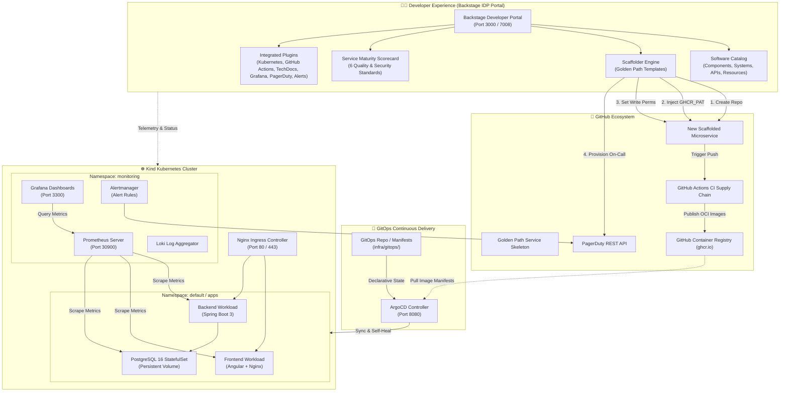
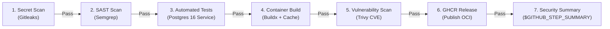
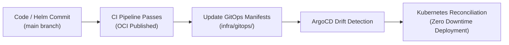

# 🚀 Enterprise Internal Developer Platform (IDP)

> **A Production-Grade Internal Developer Platform built on Backstage, Kubernetes, ArgoCD GitOps, GitHub Actions Supply Chain Security, Service Maturity Scorecards, PagerDuty On-Call, and Full-Stack Observability.**

[](https://backstage.io)
[](https://kubernetes.io)
[](https://argo-cd.readthedocs.io)
[](https://github.com/features/actions)
[](https://trivy.dev)
[](https://prometheus.io)
[](https://pagerduty.com)
[](tests/)

---

## 📑 Table of Contents

- [Executive Summary](#-executive-summary)
- [Architecture & Workflow Diagrams](#-architecture--workflow-diagrams)
  - [1. High-Level IDP Architecture](#1-high-level-idp-architecture)
  - [2. Golden Path Supply Chain Security Pipeline](#2-golden-path-supply-chain-security-pipeline)
  - [3. GitOps Continuous Delivery Loop](#3-gitops-continuous-delivery-loop)
- [Key Features & Capabilities](#-key-features--capabilities)
  - [1. Self-Service Golden Path Templates](#1-self-service-golden-path-templates)
  - [2. Service Maturity & Quality Scorecards](#2-service-maturity--quality-scorecards)
  - [3. Automated PagerDuty On-Call Provisioning](#3-automated-pagerduty-on-call-provisioning)
  - [4. Full-Stack Observability & Prometheus Alerts](#4-full-stack-observability--prometheus-alerts)
  - [5. Shift-Left Supply Chain Security](#5-shift-left-supply-chain-security)
  - [6. TechDocs as Code](#6-techdocs-as-code)
- [Repository Structure](#-repository-structure)
- [Quickstart Guide](#-quickstart-guide)
  - [Prerequisites](#prerequisites)
  - [Phase 1: Cluster & Infrastructure Provisioning](#phase-1-cluster--infrastructure-provisioning)
  - [Phase 2: ArgoCD GitOps Deployment](#phase-2-argocd-gitops-deployment)
  - [Phase 3: Launching the Backstage Portal](#phase-3-launching-the-backstage-portal)
- [Verification & Automated Test Suite](#-verification--automated-test-suite)
- [Troubleshooting & Gotchas](#-troubleshooting--gotchas)
- [Maintainer](#-maintainer)

---

## 🌟 Executive Summary

This project delivers an **enterprise-grade Internal Developer Platform (IDP)** designed to eliminate developer cognitive load, standardize microservice lifecycles, and enforce automated security, observability, and operational excellence across the engineering organization.

### Core Platform Pillars:
1. **Self-Service Golden Paths**: Engineers scaffold production-ready microservices (Angular + Spring Boot 3 + PostgreSQL + Helm Chart + GitHub Actions CI) in under 10 seconds with zero boilerplate.
2. **Automated Provisioning & Secrets Injection**: Automatic GitHub repository creation, workflow write permissions, `GHCR_PAT` secret injection, and dedicated PagerDuty on-call service creation via Scaffolder actions.
3. **Shift-Left Supply Chain Security**: 7-stage CI/CD security gate combining Gitleaks secrets detection, Semgrep SAST code analysis, PostgreSQL integration testing, container layer vulnerability scanning (Trivy), and GHCR OCI releases.
4. **Declarative GitOps (ArgoCD)**: Continuous delivery with automated drift detection, self-healing, and declarative synchronization from Git to Kubernetes.
5. **Service Maturity Scorecards**: Real-time evaluation of services against 6 platform engineering standards (Security, Testing, Containerization, Observability, Alerting, Delivery) with Gold/Silver/Bronze certification tiers.
6. **Unified Observability & Incident Response**: Native Backstage integration with Prometheus metric scrapers, Grafana performance dashboards, Loki log explorer, Alertmanager alerts, and PagerDuty incident management.

---

## 🏛️ Architecture & Workflow Diagrams

### 1. High-Level IDP Architecture



---

### 2. Golden Path Supply Chain Security Pipeline

Every scaffolded service and existing application executes an automated 7-stage quality and security gate:



---

### 3. GitOps Continuous Delivery Loop



---

## ⚡ Key Features & Capabilities

### 1. Self-Service Golden Path Templates
- **Zero-Friction Scaffolding**: Create a full-stack microservice (Frontend, Backend, Database, Helm Chart, CI/CD, Documentation, and Catalog descriptor) from Backstage with a single form.
- **Automated Repository Bootstrapping**:
  1. Clones and customizes the skeleton repository.
  2. Publishes the private repository to GitHub (`FatmaMejri1/<service-name>`).
  3. Injects the `GHCR_PAT` GitHub secret for container registry access.
  4. Configures repository Actions workflow permissions (`write`).
  5. Provisions a dedicated PagerDuty on-call escalation service.
  6. Automatically registers both the `System` and `Component` entities in the Backstage Software Catalog.

### 2. Service Maturity & Quality Scorecards
- Evaluates services in real-time on the **Scorecard** tab against 6 platform standards:
  | Standard | Criteria | Category |
  | :--- | :--- | :--- |
  | **Shift-Left Security** | Gitleaks secrets detection, Semgrep SAST, and Trivy CVE scanning in CI | Security |
  | **Automated Testing** | Spring Boot + JUnit 5 + PostgreSQL integration test pipeline | Quality |
  | **Containerization Standard** | Multi-stage Dockerfile with non-root security context (`USER appuser`) | Operations |
  | **Operational Observability** | Prometheus `/actuator/prometheus` scraping + Grafana dashboards | Observability |
  | **Incident Management** | PagerDuty on-call service ID integration (`pagerduty.com/service-id`) | Reliability |
  | **Declarative GitOps** | ArgoCD Application descriptor linked and synchronized | Delivery |
- Calculates maturity tiers: **Gold (100%)**, **Silver (≥80%)**, **Bronze (≥50%)**, or **Needs Improvement (<50%)**.

### 3. Automated PagerDuty On-Call Provisioning
- Automatically calls `POST /proxy/pagerduty/services` during scaffolding to create a dedicated PagerDuty on-call escalation service.
- Injects the generated service ID into the component's `catalog-info.yaml` annotation (`pagerduty.com/service-id: <ID>`).
- Embedded PagerDuty tab in Backstage allowing developers to trigger incidents, view on-call schedules, and escalate alerts directly from the portal.

### 4. Full-Stack Observability & Prometheus Alerts
- **Real-Time Alert Table**: Embedded `PrometheusAlertsCard` displaying firing/pending Prometheus rules filtered by service selector.
- **Grafana Dashboards**: Pre-configured dashboards for JVM telemetry, HTTP throughput/latency, Nginx metrics, and PostgreSQL connections.
- **Loki Log Explorer**: Direct links to stream container logs across Kubernetes namespaces.

### 5. Shift-Left Supply Chain Security
- **Gitleaks**: Scans full commit history for leaked credentials and tokens.
- **Semgrep**: Checks source code and Dockerfiles against OWASP Top 10 security standards.
- **Trivy**: Scans container layers for HIGH and CRITICAL CVE vulnerabilities.
- **Audit Matrix**: Generates formatted security audit tables in GitHub Actions summary.

### 6. TechDocs as Code
- Centralized technical documentation engine built on **MkDocs** and Markdown.
- Documentation lives alongside application code (`docs/` and `mkdocs.yml`) and is rendered directly inside the Backstage portal.

---

## 📂 Repository Structure

```text
idp-backstage/
├── apps/
│   └── crm/                                # Reference Application
│       ├── crm-frontend/                   # Angular 17 SPA + Nginx
│       ├── crm-backend/                    # Spring Boot 3 + JPA + Actuator
│       ├── crm-chart/                      # Production Helm Chart + ServiceMonitors
│       ├── catalog-info.yaml               # System, Component, Resource, API Descriptors
│       ├── mkdocs.yml                      # TechDocs Configuration
│       └── docs/                           # Technical Architecture Docs
├── backstage/                              # Backstage Developer Portal
│   ├── app-config.yaml                     # Declarative Portal Configuration
│   ├── packages/
│   │   ├── app/                            # Frontend UI & Plugins
│   │   │   └── src/modules/
│   │   │       ├── alerts/                 # Prometheus Alerts Card
│   │   │       ├── scorecard/              # Service Maturity Scorecard
│   │   │       └── nav/                    # Navigation & Branding
│   │   └── backend/                        # Node.js Backend Engine & Proxy Services
├── templates/
│   └── golden-path-service/                # Software Template Definition
│       ├── template.yaml                   # Scaffolder Steps (Repo, Secrets, PagerDuty)
│       └── skeleton/                       # Microservice Boilerplate
│           ├── catalog-info.yaml           # Multi-entity System + Component descriptor
│           ├── mkdocs.yml                  # TechDocs skeleton
│           ├── deploy/helm/                # Standardized Helm Chart
│           └── .github/workflows/          # 7-Stage CI/CD Security Pipeline
├── infra/
│   ├── kind/                               # Kind Cluster Configuration (Port mappings)
│   ├── argocd/                             # ArgoCD Installation Scripts
│   ├── gitops/                             # Declarative ArgoCD Applications
│   └── prometheus/                         # Prometheus & Alertmanager Configs
├── tests/                                  # Automated Test Suite (51 Tests)
│   ├── test_bf01_catalog.py                # Catalog Validation Tests
│   ├── test_bf02_containerization.py       # Dockerfile & Security Tests
│   ├── test_bf03_ci.py                     # CI/CD Pipeline Tests
│   ├── test_bf04_helm.py                   # Helm Chart Integrity Tests
│   ├── test_bf05_gitops.py                 # ArgoCD GitOps Tests
│   ├── test_bf06_kubernetes.py             # Kubernetes Manifest Tests
│   ├── test_bf07_github_actions.py         # Actions Workflow Tests
│   ├── test_bf08_monitoring.py             # Grafana & Prometheus Tests
│   ├── test_bf09_logs.py                   # Loki & Logging Tests
│   ├── test_bf10_pagerduty.py              # PagerDuty Integration Tests
│   ├── test_bnf06_secrets.py               # Secret Management Tests
│   └── test_bnf10_kyverno.py               # Kyverno Policy Tests
└── README.md                               # Platform Documentation
```

---

## 🚀 Quickstart Guide

### Prerequisites
- **Docker** & **Kind** (v0.20+)
- **Kubernetes CLI (`kubectl`)** & **Helm** (v3.12+)
- **Node.js** (v20 LTS) & **Yarn**
- **Python 3.10+** & `pytest`
- **GitHub Personal Access Token** (`GITHUB_TOKEN` with `repo`, `workflow`, `write:packages` scopes)
- **PagerDuty API Token** (for on-call incident routing)

---

### Phase 1: Cluster & Infrastructure Provisioning

1. **Clone the repository**:
   ```bash
   git clone https://github.com/FatmaMejri1/idp-backstage.git
   cd idp-backstage
   ```

2. **Create the Kind Kubernetes Cluster**:
   ```bash
   kind create cluster --config infra/kind/kind-config.yaml --name idp-backstage
   ```

3. **Deploy Ingress Controller**:
   ```bash
   kubectl apply -f https://raw.githubusercontent.com/kubernetes/ingress-nginx/main/deploy/static/provider/kind/deploy.yaml
   kubectl wait --namespace ingress-nginx      --for=condition=ready pod      --selector=app.kubernetes.io/component=controller      --timeout=180s
   ```

4. **Deploy Prometheus & Grafana Monitoring Stack**:
   ```bash
   helm repo add prometheus-community https://prometheus-community.github.io/helm-charts
   helm repo update
   helm install prometheus prometheus-community/kube-prometheus-stack      --namespace monitoring --create-namespace      -f apps/crm/crm-chart/templates/alertmanager-config.yaml
   ```

---

### Phase 2: ArgoCD GitOps Deployment

1. **Install ArgoCD**:
   ```bash
   chmod +x infra/argocd/install.sh
   ./infra/argocd/install.sh
   ```

2. **Deploy Applications via GitOps**:
   ```bash
   kubectl apply -f infra/gitops/crm-application.yaml
   ```

3. **Verify GitOps Sync Status**:
   ```bash
   kubectl get applications -n argocd
   # Output will show Synced & Healthy ✅
   ```

---

### Phase 3: Launching the Backstage Portal

1. **Configure Environment Variables**:
   ```bash
   cd backstage
   cp .env.example .env
   ```
   Ensure `.env` contains:
   ```ini
   GITHUB_TOKEN="ghp_your_github_token"
   PAGERDUTY_TOKEN="your_pagerduty_api_token"
   ```

2. **Install Dependencies & Start Portal**:
   ```bash
   yarn install
   yarn dev
   ```

3. **Access Services**:
   - **Backstage Portal**: [http://localhost:3000](http://localhost:3000)
   - **Backend API**: [http://localhost:7008](http://localhost:7008)
   - **ArgoCD Web UI**: [http://localhost:8080](http://localhost:8080)
   - **Grafana Dashboards**: [http://localhost:3300](http://localhost:3300)
   - **Prometheus UI**: [http://localhost:30900](http://localhost:30900)

---

## 🧪 Verification & Automated Test Suite

Run the full platform test suite covering all architecture components:

```bash
pytest tests/ -v
```

### Test Coverage Breakdown:
```text
tests/test_bf01_catalog.py .............. [ 5%] - Software Catalog & Entity Relations
tests/test_bf02_containerization.py ..... [ 9%] - Multi-Stage & Non-Root Dockerfiles
tests/test_bf03_ci.py ................... [13%] - Decoupled CI/CD Security Workflows
tests/test_bf04_helm.py ................. [21%] - Helm Chart Manifests & ServiceMonitors
tests/test_bf05_gitops.py ............... [35%] - ArgoCD Application Definitions
tests/test_bf06_kubernetes.py ........... [43%] - Kubernetes Ingress, Pods & Volumes
tests/test_bf07_github_actions.py ....... [52%] - GHA Summary Tables & Step Definitions
tests/test_bf08_monitoring.py ........... [64%] - PrometheusRules & Grafana Dashboards
tests/test_bf09_logs.py ................. [68%] - Loki Log Aggregator Configurations
tests/test_bf10_pagerduty.py ............ [78%] - PagerDuty API & On-Call Webhooks
tests/test_bnf06_secrets.py ............. [84%] - Secret Scrubbing & GHCR Integration
tests/test_bnf10_kyverno.py ............. [100%] - Security & Admission Control Policies
=========================== 51 passed in 0.18s ===========================
```

---

## 🔧 Troubleshooting & Gotchas

### 1. GHCR Package Push Permission Denied
- **Issue**: `denied: permission_denied: read_package` when pushing to `ghcr.io`.
- **Cause**: Personal GitHub accounts require publishing tokens with the `write:packages` scope.
- **Solution**: Handled automatically by the Golden Path Scaffolder action (`github:repo:set-secret`), which injects your `GHCR_PAT` into every new repository at creation time.

### 2. Missing Catalog System Entities
- **Issue**: *"This entity has relations to other entities, which can't be found in the catalog"*.
- **Solution**: The Golden Path template defines multi-document YAML descriptors in `catalog-info.yaml` containing both `kind: System` and `kind: Component`.

### 3. Frontend Config Visibility
- **Issue**: *"Failed to read configuration value at '...' as it is not visible"*.
- **Solution**: Sensitive backend secrets and internal keys are configured exclusively in `packages/backend` and proxy endpoints, avoiding frontend leaks.

---

## 👤 Maintainer

- **Platform Engineer**: Fatma Mejri ([@FatmaMejri1](https://github.com/FatmaMejri1))
- **Repository**: [https://github.com/FatmaMejri1/idp-backstage](https://github.com/FatmaMejri1/idp-backstage)
