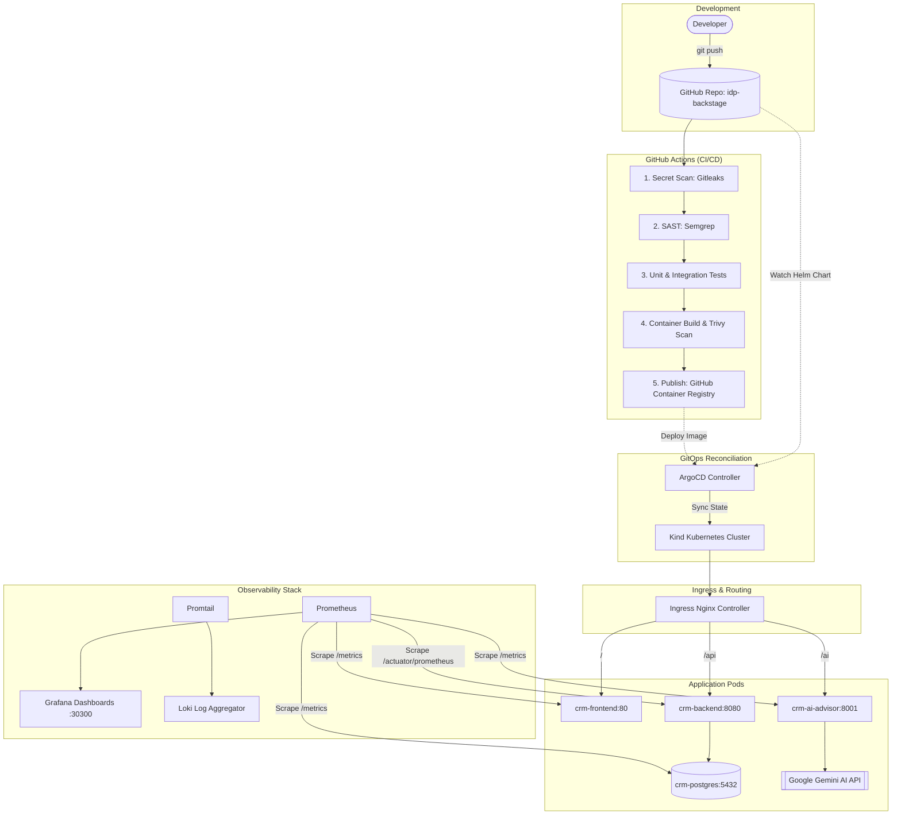

# System Architecture

The CRM platform runs in a local multi-node **Kubernetes (Kind)** cluster managed via **ArgoCD GitOps** and integrated into the **Backstage Internal Developer Portal**.

## Network Paths & Ingress Rules

The cluster ingress is managed by `ingress-nginx` listening on host port 80:

- `http://crm.local/` → Routes to `crm-frontend` Service (port 80)
- `http://crm.local/api/*` → Routes to `crm-backend` Service (port 8080)
- `http://crm.local/ai/*` → Routes to `crm-ai-advisor` Service (port 8001)
- `http://crm.local/ai/docs` → FastAPI Swagger interactive documentation
