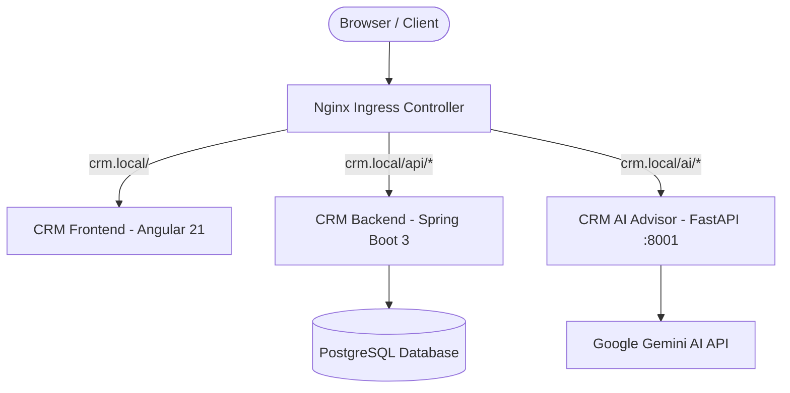

# CRM Platform

Welcome to the **CRM Platform** documentation on the Internal Developer Platform (IDP).

The CRM platform is a cloud-native, microservices-based application serving as the primary reference implementation for platform engineering, GitOps delivery, automated CI/CD security scanning, and AI-assisted workflows.

## Core Microservices

| Service | Technology | Port | Ingress Route | Purpose |
|---|---|---|---|---|
| **crm-frontend** | Angular 21, Nginx, Tailwind | 80 | `crm.local/` | Commercial CRM user interface |
| **crm-backend** | Spring Boot 3.4, Java 17, Maven | 8080 | `crm.local/api/*` | Business logic, client & deal management |
| **crm-postgres** | PostgreSQL 16 + exporter | 5432 | Internal | Persistent relational data store |
| **crm-ai-advisor** | FastAPI, Python 3.12, Uvicorn | 8001 | `crm.local/ai/*` | AI-powered sales advice powered by Gemini |

## Documentation Sections

- [Architecture](architecture.md) — System topology, networking, and request lifecycles
- [AI Advisor](ai-advisor.md) — Gemini AI microservice design, prompt engineering, and API
- [Deployment](deployment.md) — Kubernetes manifests, Helm charts, and ArgoCD GitOps
- [Observability](observability.md) — Prometheus scraping, Grafana dashboards, Loki logs, and alerts
- [CI/CD Pipeline](cicd.md) — 5-stage DevSecOps pipeline in GitHub Actions
- [Runbook](runbook.md) — Operations, troubleshooting, and incident response
